# TurnoBank 🏦

Sistema de Gestión de Turnos para bancos, desarrollado con arquitectura de microservicios. Permite registrar usuarios, asignar turnos consecutivos, gestionar notificaciones y administrar los tipos de servicios bancarios disponibles.

---

## Descripción

En este proyecto implementé un sistema distribuido llamado **TurnoBank**, compuesto por cuatro microservicios: **users**, **turns**, **notifications** y **servicios**. El objetivo fue construir un sistema que funcione de forma organizada aunque alguno de sus servicios falle, aplicando conceptos como circuit breaker, half-open, health checks, logs descriptivos y monitoreo centralizado.

---

## Arquitectura del sistema

El sistema está compuesto por los siguientes componentes:

- El **gateway** recibe todas las peticiones del cliente y las redirige al microservicio correspondiente. También aplica el circuit breaker y expone los endpoints de monitoreo.
- Cada microservicio es independiente, corre en su propio contenedor Docker y tiene su propia base de datos PostgreSQL.
- La comunicación entre servicios se hace mediante HTTP/REST.

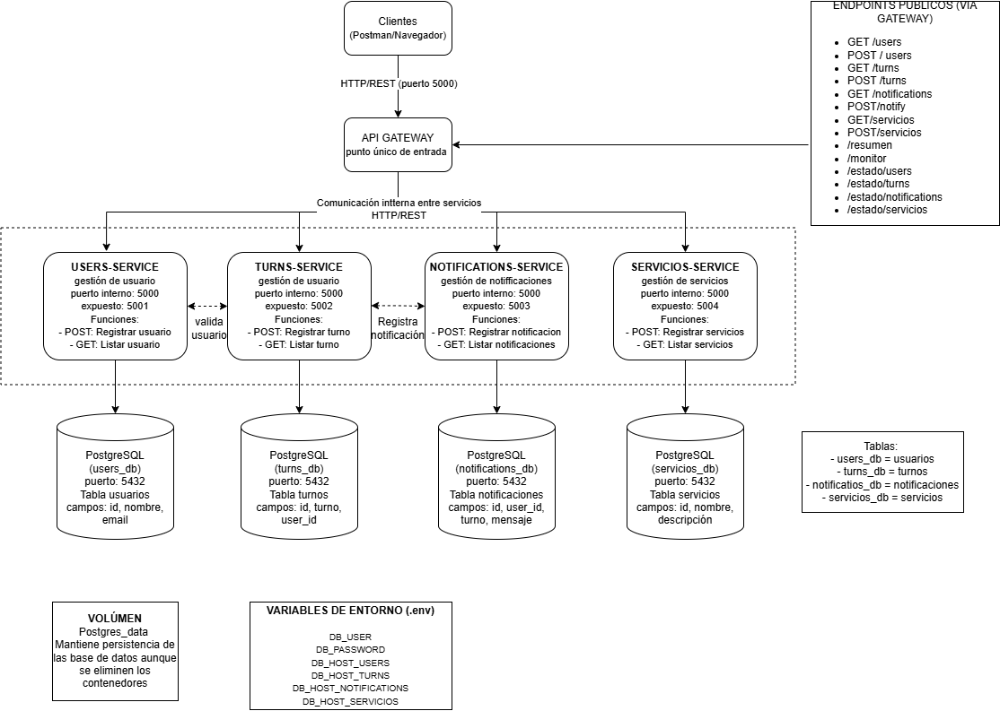

### Microservicios

| Servicio | Puerto | Descripción |
|---|---|---|
| gateway-service | 5000 | Punto de entrada único. Circuit breaker y monitoreo |
| users-service | 5001 | Gestión de usuarios |
| turns-service | 5002 | Asignación de turnos consecutivos |
| notifications-service | 5003 | Historial de notificaciones |
| servicios-service | 5004 | Tipos de servicios bancarios |

### Bases de datos

Cada servicio tiene su propia base de datos PostgreSQL con persistencia mediante volúmenes Docker:

| Base de datos | Tablas |
|---|---|
| db-users | usuarios (id, nombre, email) |
| db-turns | turnos (id, turno, user_id) |
| db-notifications | notificaciones (id, user_id, turno, mensaje) |
| db-servicios | servicios (id, nombre, descripcion) |

---

## Tecnologías utilizadas

- Python (Flask) para los microservicios
- PostgreSQL 15 como base de datos
- Docker y Docker Compose para la contenerización
- Postman para las pruebas

---

## Estructura del proyecto

```
gestor-turnos/
├── docker-compose.yml
├── .env.example
├── README.md
├── gateway-service/
│   ├── app.py
│   ├── Dockerfile
│   └── requirements.txt
├── users-service/
│   ├── app.py
│   ├── Dockerfile
│   └── requirements.txt
├── turns-service/
│   ├── app.py
│   ├── Dockerfile
│   └── requirements.txt
├── notifications-service/
│   ├── app.py
│   ├── Dockerfile
│   └── requirements.txt
├── servicios-service/
│   ├── app.py
│   ├── Dockerfile
│   └── requirements.txt
└── evidencias/
```

---

## Instrucciones de ejecución

**1. Clona el repositorio:**
```bash
git clone https://github.com/StefaniaCo/Trabajos_Distribuidos.git
cd Trabajos_Distribuidos/corte_3/gestor-turnos
```

**2. Configura las variables de entorno:**
```bash
cp .env.example .env
```
Edita el `.env` con tus credenciales de base de datos.

**3. Levanta todos los servicios:**
```bash
docker-compose up --build
```

**4. Verifica que todo esté corriendo:**
```bash
docker ps
```


---

## Evidencias del sistema funcionando

---

### Visualización de los contenedores activos mediante el comando **docker ps**

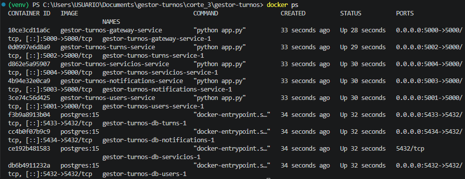 

---

### Usuarios

**Crear usuario (POST /users)**

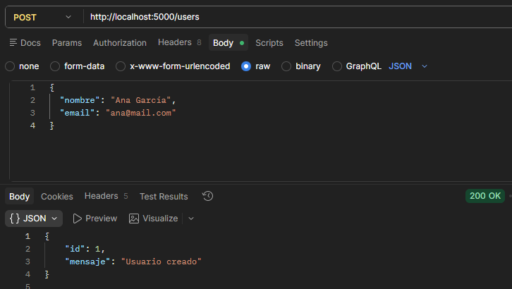

**Ver usuarios (GET /users)**

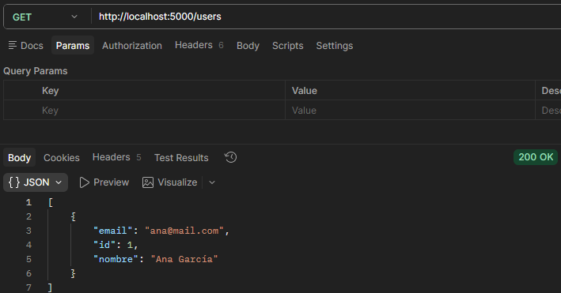

---

### Turnos

**Crear turno (POST /turn)**

El sistema valida primero que el usuario exista en users-service antes de asignar el turno. Si el usuario existe, genera el turno consecutivo y notifica automáticamente al servicio de notificaciones.

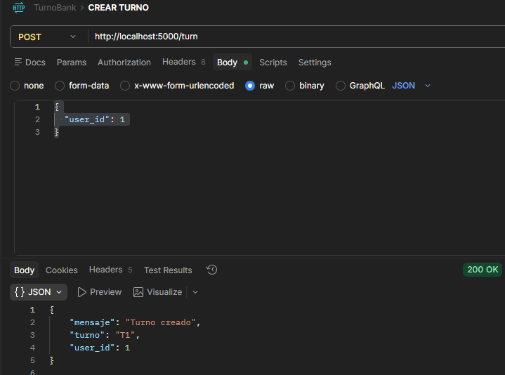

**Ver turnos (GET /turns)**

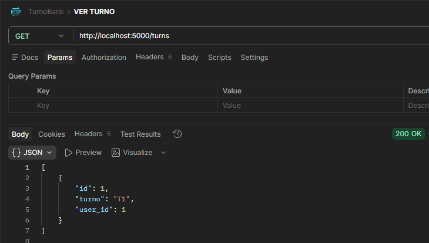

---

### Servicios bancarios

**Registrar servicio (POST /servicios)**

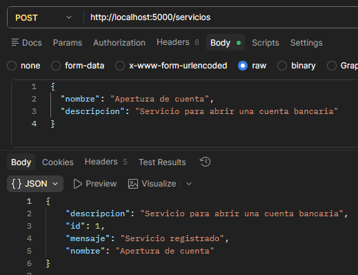

**Ver servicios (GET /servicios)**

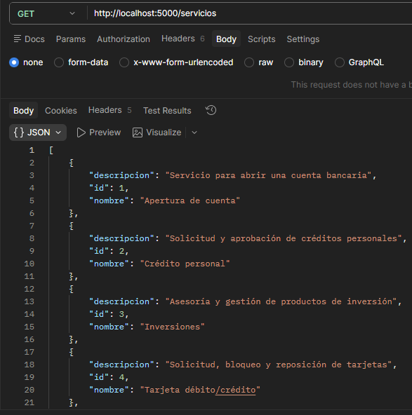

---

### Notificaciones

**Registrar notificación manual (POST /notify)**

Normalmente las notificaciones se crean automáticamente cuando se genera un turno. También se pueden registrar manualmente.

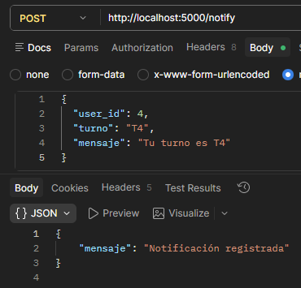

**Ver notificaciones (GET /notifications)**

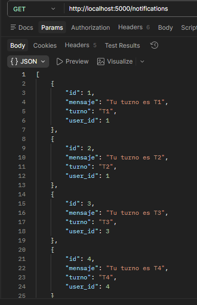

---

### Resumen general

El endpoint `/resumen` consulta todos los servicios a la vez y devuelve los datos en una sola respuesta.

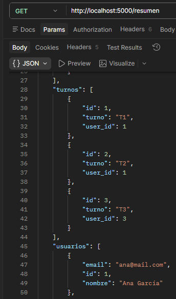
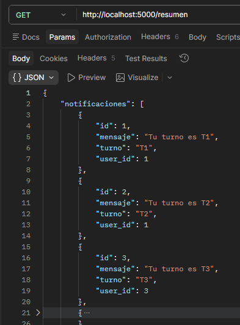
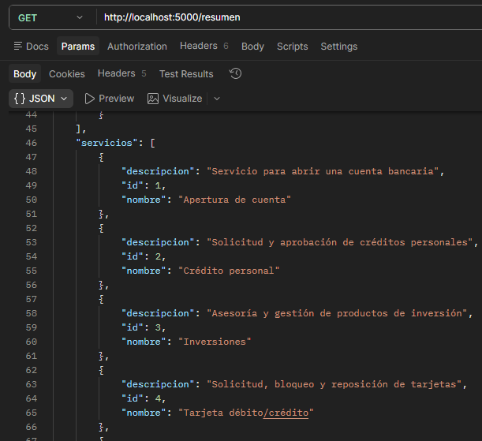

---

### Persistencia de datos

Los datos se mantienen aunque los contenedores se apaguen, gracias a los volúmenes Docker definidos en el `docker-compose.yml`. Se puede verificar haciendo `docker-compose down` y volviendo a levantar con `docker-compose up` los datos siguen ahí.

---

## Circuit Breaker y Half-Open

El gateway implementa el patrón **Circuit Breaker** con un circuito independiente por cada servicio. Esto significa que si un servicio falla, solo su circuito se abre — los demás siguen funcionando normalmente.

**Configuración:**
- Se abren **3 fallos consecutivos** abren el circuito
- El circuito espera **10 segundos** antes de intentar recuperarse (half-open)

---

**Paso 1 — Apagar el servicio de turnos**

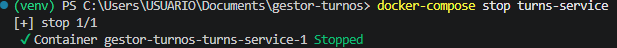

**Paso 2 — Primera petición (fallo)**

Las primeras 3 peticiones intentan conectarse y fallan. El gateway registra cada fallo.

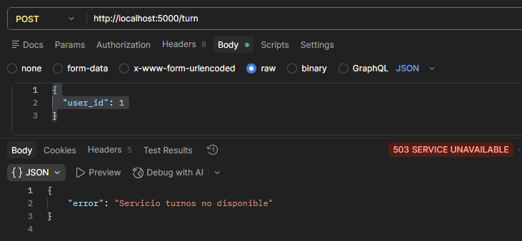

**Paso 3 — Petición #4 (circuito abierto)**

A partir del tercer fallo, el circuito se abre. Las peticiones siguientes reciben el error de inmediato sin intentar conectarse.

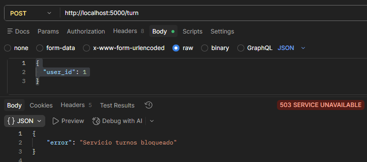

**Paso 4 — Logs mostrando el circuito abierto**

En los logs se puede ver exactamente cómo fue contando los fallos hasta abrir el circuito.

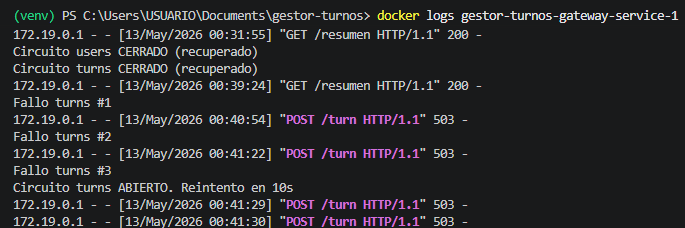

---

**Paso 5 — Volver a encender el servicio de turnos**

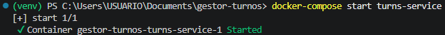

**Paso 6 — Esperando 10 segundos y haciendo una petición**

Después de los 10 segundos de espera, el sistema entra en estado **half-open** y deja pasar una petición de prueba. Si funciona, cierra el circuito automáticamente.

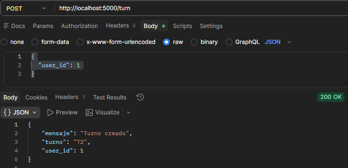

**Paso 7 — Logs mostrando el half-open y la recuperación**

Los logs confirman el flujo completo: `HALF-OPEN turns: probando reconexión...` seguido de `Circuito turns CERRADO (recuperado)`.

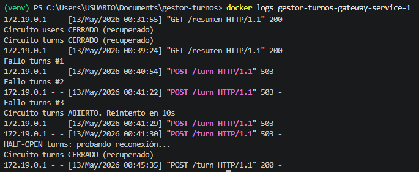

---

## Health Checks

Cada servicio expone un endpoint `/health` que confirma que está activo.

**Directo a cada servicio:**

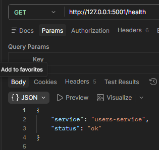
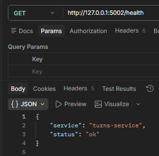
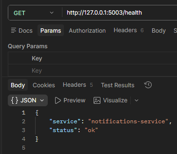
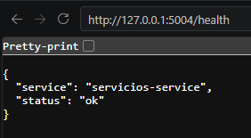

**Desde el gateway (puerto 5000):**

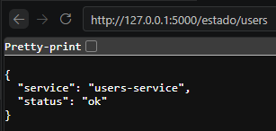
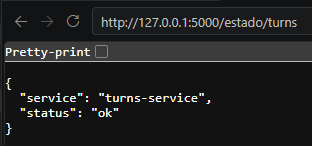
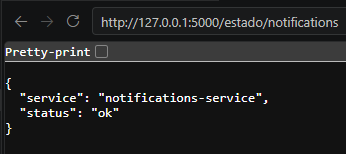
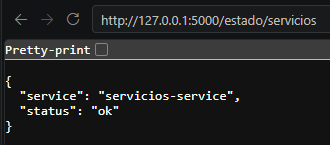

---

## Monitoreo centralizado

El endpoint `/monitor` consulta todos los servicios a la vez y muestra el estado, la latencia y los contadores de fallos y peticiones de cada uno en una sola respuesta.

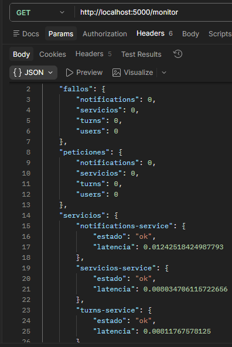

---

## Logs descriptivos

Cada servicio registra en consola lo que está haciendo en cada momento: qué petición recibió, cuánto tardó en responder y si hubo algún error. Esto permite rastrear exactamente qué pasó y en qué servicio.

**Gateway — tiempos de respuesta y estado del circuit breaker:**

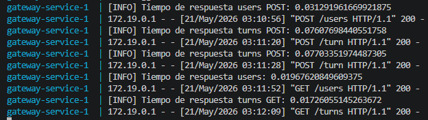

**Users-service — creación y consulta de usuarios:**

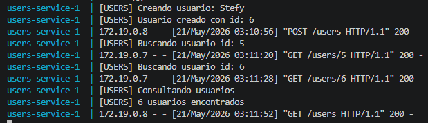

**Turns-service — creación de turnos y validación de usuarios:**

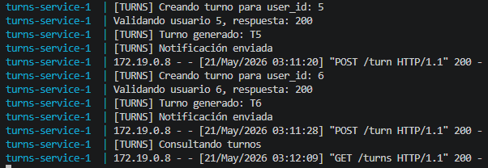

**Notifications-service — registro de notificaciones:**

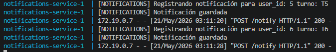

**Servicios-service — registro y consulta de servicios bancarios:**

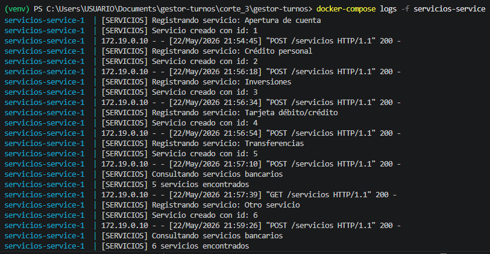

---

## Resultados observados

El sistema demostró que puede detectar fallos de forma automática e inmediata. Cuando se apagó el servicio de turnos, el gateway registró cada fallo en los logs, abrió el circuito al tercer intento y comenzó a responder con error instantáneo sin gastar tiempo en intentos fallidos. Cuando el servicio volvió, el sistema se recuperó solo después de 10 segundos sin necesidad de reiniciar nada.

Lo más importante fue comprobar que el fallo de un servicio no afectó a los demás — mientras turnos estaba caído, usuarios, notificaciones y servicios siguieron respondiendo con normalidad.

**Conclusiones:**

- El circuit breaker protege al sistema de gastar recursos en servicios caídos
- El half-open permite la recuperación automática sin intervención manual
- Los logs permiten rastrear exactamente qué pasó y en qué momento
- El `/monitor` da visibilidad completa del sistema con una sola petición
- La persistencia con volúmenes garantiza que los datos no se pierden aunque los contenedores se reinicien
- Cada servicio con su propia base de datos asegura que los fallos queden completamente aislados

---
