# Laboratorio: Sistema de Pedidos Distribuido con Monitoreo

---

## Descripción

En este laboratorio implementé un sistema distribuido compuesto por tres microservicios: **pedidos**, **inventario** y **pagos**. El objetivo principal fue aprender a monitorear este tipo de sistemas, especialmente cuando uno de los servicios falla (en este caso, el servicio de pagos).

El laboratorio se dividió en 5 fases: logs, health checks, monitoreo centralizado, simulación de fallos y métricas.

---

##  Arquitectura del sistema

El sistema está compuesto por los siguientes componentes:

- El **gateway** recibe todas las peticiones y las redirige al microservicio correspondiente.
- Cada microservicio es independiente y corre en su propio contenedor Docker.
- El gateway también expone endpoints de monitoreo (`/monitor`) y métricas (`/metricas`).


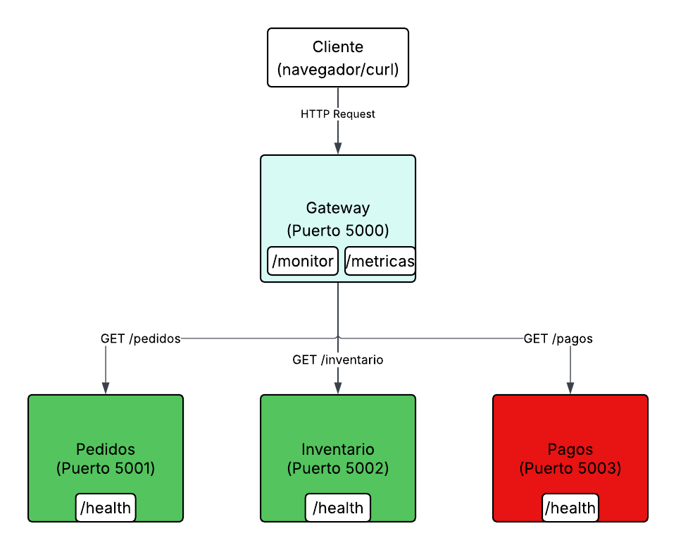


---

## Tecnologías utilizadas

- Python (Flask) para los microservicios
- Docker y Docker Compose para orquestar los contenedores
- Logs en consola por servicio

---

## Estructura del proyecto

```
laboratorio-monitoreo/
├── docker-compose.yml
├── README.md
├── gateway/
│   ├── app.py
│   ├── Dockerfile
│   └── requirements.txt
├── inventario/
│   ├── app.py
│   ├── Dockerfile
│   └── requirements.txt
├── pagos/
│   ├── app.py
│   ├── Dockerfile
│   └── requirements.txt
└── pedidos/
    ├── app.py
    ├── Dockerfile
    └── requirements.txt
```

---

## Fases del laboratorio

---

### FASE 1 — Logs descriptivos

**¿Qué hice?**

Configuré cada microservicio para que registrara en consola lo que estaba haciendo en cada momento: cuándo recibía una solicitud, cuánto tardaba en responder y si hubo algún error.

**¿Por qué es importante?**

Sin logs, cuando algo falla no hay forma de saber qué pasó ni en qué servicio. Los logs son la primera línea de diagnóstico en cualquier sistema distribuido.

**Evidencia:**

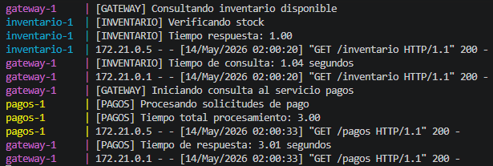

En la imagen se puede ver cómo cada servicio imprime su actividad con su nombre entre corchetes (`[GATEWAY]`, `[INVENTARIO]`, `[PAGOS]`), el tiempo de respuesta y el código HTTP de cada petición. Por ejemplo, el servicio de inventario respondió en **1.00 segundos** y el de pagos tardó **3.00 segundos** en procesar las solicitudes de pago.

---

### FASE 2 — Health Checks (Verificación de salud)

**¿Qué hice?**

Agregué un endpoint `/health` a cada microservicio. Este endpoint simplemente responde con un JSON que indica si el servicio está funcionando o no.

**¿Por qué es importante?**

En un sistema distribuido, es necesario saber rápidamente cuáles servicios están "vivos". El health check es la forma más simple de saberlo.

**Evidencia:**

Servicio de **inventario** respondiendo correctamente en el puerto 5002:

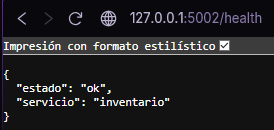

Servicio de **pagos** respondiendo correctamente en el puerto 5003:

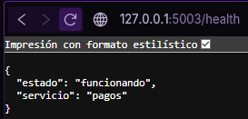

Servicio de **pedidos** respondiendo correctamente en el puerto 5001:

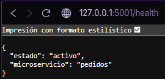

Cada servicio responde con su estado y nombre. El gateway puede consultar estos endpoints para saber si los servicios están disponibles antes de redirigir una petición.

---

### FASE 3 — Monitoreo centralizado

**¿Qué hice?**

Creé un endpoint `/monitor` en el gateway que consulta automáticamente el `/health` de todos los microservicios y presenta el resultado consolidado en una sola respuesta.

**¿Por qué es importante?**

En lugar de revisar cada servicio por separado, el monitoreo centralizado da una vista general del estado del sistema completo con una sola consulta.

**Evidencia:**

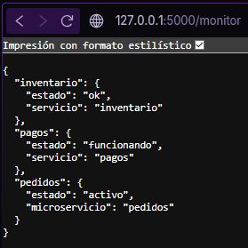

En la imagen se puede ver cómo el endpoint `127.0.0.1:5000/monitor` retorna el estado de los tres servicios al mismo tiempo: inventario (`ok`), pagos (`funcionando`) y pedidos (`activo`). Esto da una visión completa del sistema en tiempo real.

---

### FASE 4 — Simulación de fallos

**¿Qué hice?**

Apagué intencionalmente el contenedor del servicio de pagos usando Docker y observé cómo reaccionaba el sistema: los logs, los errores y el cambio en el monitoreo.

**¿Por qué es importante?**

No basta con que el sistema funcione cuando todo está bien. Hay que saber cómo se comporta y qué información entrega cuando algo falla.

**Cómo apagué el servicio:**

```bash
docker stop laboratorio-monitoreo-pagos-1
```

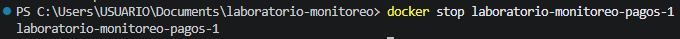


**Lo que pude ver en los logs:**


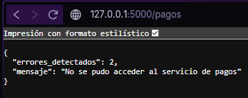


El gateway intentó consultar el servicio de pagos y registró el error: `[ERROR] Servicio pagos caído. Total errores: 1`, luego `Total errores: 2`, y el servidor respondió con un código **503** (servicio no disponible).


**Respuesta del endpoint `/pagos` con el servicio caído:**

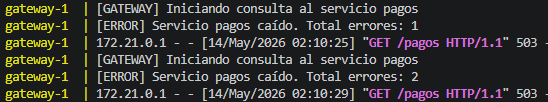

El gateway detectó que no pudo conectarse al servicio y devolvió un mensaje claro: `"No se pudo acceder al servicio de pagos"` con `"errores_detectados": 2`.


**Estado del monitor con el servicio caído:**

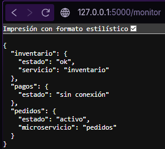

El endpoint `/monitor` reflejó inmediatamente el cambio: el servicio de pagos aparece ahora con estado `"sin conexión"`, mientras que inventario y pedidos siguen funcionando normalmente.

---

### FASE 5 — Métricas

**¿Qué hicimos?**

Creamos un endpoint `/metricas` en el gateway que acumula estadísticas durante la ejecución: cuántas veces se consultó el servicio de pagos y cuántos errores se registraron.

**¿Por qué es importante?**

Los logs nos dicen qué pasó en el momento. Las métricas nos dicen qué tanto pasó a lo largo del tiempo, lo que es útil para detectar patrones, picos de errores o degradación del servicio.

**Evidencia:**

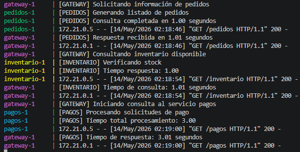

Aquí se puede ver el sistema operando con todos los servicios activos, con tiempos de respuesta normales en los tres microservicios.


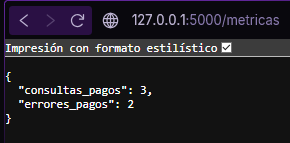

El endpoint `/metricas` mostró que durante la prueba se realizaron **3 consultas** al servicio de pagos y se registraron **2 errores**, lo que coincide perfectamente con lo que se vio en los logs y la simulación de fallos de la Fase 4.

---

## Resultados observados

Durante las pruebas pude ver que los tiempos de respuesta fueron consistentes con lo que configuré: inventario y pedidos respondían en 1 segundo y pagos en 3, ya que les agregué un `time.sleep` a cada uno para simular tiempos reales de procesamiento. Cuando apagué el contenedor de pagos, el gateway lo detectó de inmediato y los otros dos servicios siguieron funcionando sin ningún problema, lo que muestra que el fallo quedó completamente aislado.

Lo que más me llamó la atención fue que con algo tan simple como un `/health` por servicio y un `/monitor` en el gateway, ya se puede tener visibilidad real del sistema. Las métricas también fueron útiles para confirmar lo que ya había visto en los logs: 3 consultas, 2 errores, todo cuadraba.

---

**Conclusiones:**

- El sistema detectó el fallo del servicio de pagos de forma inmediata y sin afectar los demás servicios.
- Los logs permitieron rastrear exactamente cuándo y cuántas veces falló el servicio.
- El endpoint `/monitor` fue clave para tener visibilidad del estado general sin revisar cada servicio por separado.
- Las métricas confirmaron los datos observados: 3 consultas, 2 errores (los que ocurrieron mientras el contenedor estaba apagado).
- Un sistema con monitoreo básico ya entrega información suficiente para diagnosticar problemas rápidamente.

